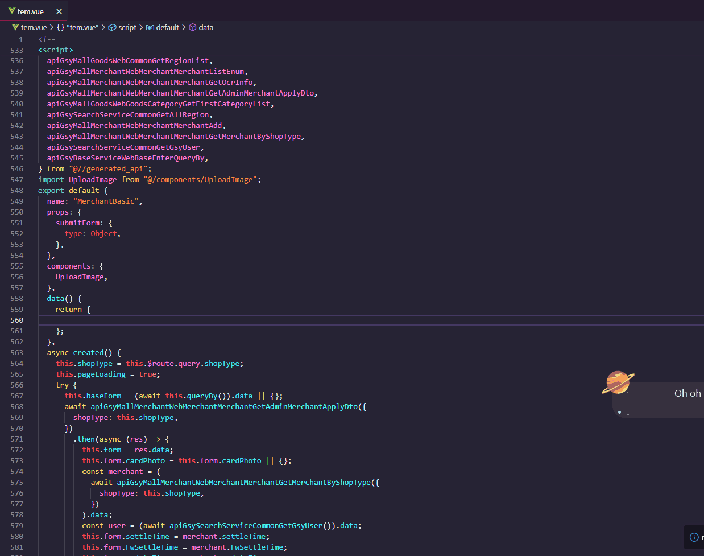

# Auto EF rules

根据 `element-ui 的 form 表单`，自动生成对应的 `rules`对象

## 使用方式:

右键点击菜单auto-EF-rules 即可自动生成对应的 `rules`

## 配置项(Settings)

### auto-EF-rules.triggers

- elementUI表单rules表单验证规则trigger配置选项,会应用于全局

### auto-EF-rules.inputElements

- 包含配置生成rules输入框元素标签

### auto-EF-rules.selectElements

- 包含配置生成rules选择器元素标签

### auto-EF-rules.uploadElements

- 包含配置生成rules上传元素标签
